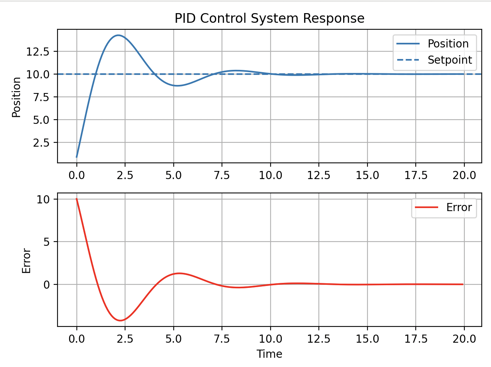

This project simulates a basic PID (Proportional–Integral–Derivative) controller regulating a dynamic system. The goal was to understand how tuning PID gains affects system stability, response time, and overshoot.
```bash
git clone https://github.com/samiyahraja/pid-control-simulation.git 
cd pid-control-simulation 
pip install -r requirements.txt 
python src/main.py
```
Example output : 

